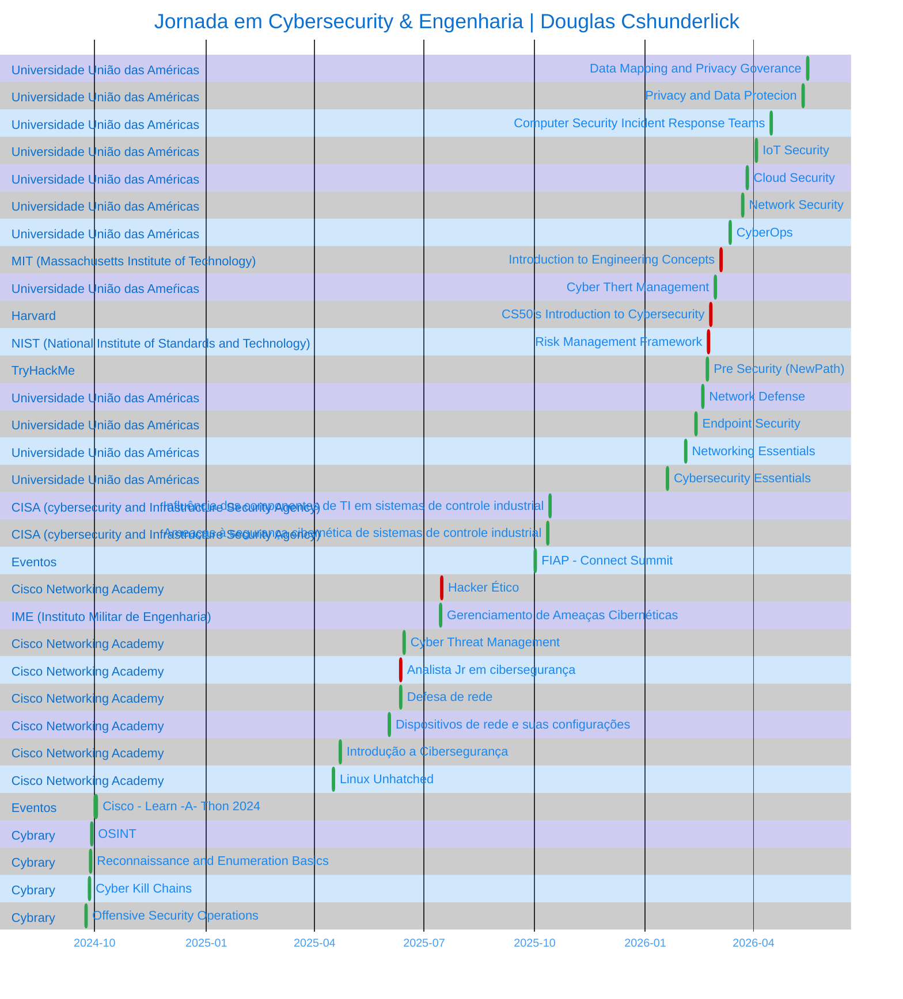

<!-- ══════════════════════ IDIOMAS / LANGUAGES ══════════════════════ -->

 

  

  

  

     
 

  

 

## Douglas Cshunderlick

<table>
<tr>
<td valign="top" width="30%">
  About

  

Software Engineer focused on Offensive Security and Governance.
I combine a technical development foundation with an attacker mindset to build
systems that are resilient from the code up.

Currently Top 6% in the TryHackMe global ranking, with constant practice
in authorized pentests, vulnerability analysis and the development of
custom tools for security automation.

<!-- ══════════════════════════ NAVEGAÇÃO ══════════════════════════ -->

Shortcuts

  

   

<a href="#formacao">

</td>
<td valign="center" width="15%">

</a>

</td>
</tr>
</table>

 

<pre>
  
</pre>

 

  

<!-- ══════════════════════════ TECNOLOGIAS ══════════════════════════ -->

## Technologies I Use

<table>
<tr>
<td valign="top" width="33%" align="center">

**Recon & Enumeration**

  

</td>
<td valign="top" width="33%" align="center">

**Exploitation & Analysis**

  

</td>
<td valign="top" width="33%" align="center">

**Frameworks & GRC**

  

</table>

 
 

  

<!-- ══════════════════════════ PROJETOS ══════════════════════════ -->

## Featured Projects & Write-ups

>Hands-on portfolio of pentests in authorized environments (HTB, TryHackMe, labs and personal projects). 
All with detailed reports.
 

- [**MBA in Information Security**](https://github.com/douglascshun/PosSegurancaDaInformacao) 
Central repository of studies, technical summaries and practical documentation.  
Skills: This repository was structured to consolidate the knowledge acquired throughout the MBA, serving as a quick-reference base for day-to-day professional application and academic reviews.
 

- [**TryHackMe Poster**](https://github.com/douglascshun/cybersec-portfolio/tree/main/Relatorios/relatorioPosterTHM#readme) 
Exploitation via PostgreSQL CVE-2019-9193 + sudo priv esc 
Skills: Nmap, credential stuffing, sudo misconfig, PoC RCE.
 

- [**HTB Meow**](https://github.com/douglascshun/cybersec-portfolio/tree/main/Relatorios/relatorioMeowHTB#readme) 
Root bypass via Telnet + Alpine misconfig 
Skills: Service enumeration, hard-coded creds, direct root.

 
 

  

<!-- ══════════════════════════ PROJETOS ══════════════════════════ -->

## Contributions

 
 

  

<!-- ══════════════════════════ FORMAÇÂO ══════════════════════════ -->
## Education

<table>
<thead>
<tr>
<th align="left">Institution</th>
<th align="left">Course</th>
<th align="left">Period</th>
</tr>
</thead>
<tbody>
<tr>
<td> <strong>União das Américas</strong></td>
<td>MBA in Information Security</td>
<td>Nov 2025 – Nov 2026 (expected)</td>
</tr>
<tr>
<td> <strong>União das Américas</strong></td>
<td>Postgraduate in Software Engineering</td>
<td>Nov 2025 – Nov 2026 (expected)</td>
</tr>
<tr>
<td> <strong>Universidade Cruzeiro do Sul</strong></td>
<td>Systems Analysis and Development</td>
<td>Jan 2023 – Dec 2025 (completed)</td>
</tr>
<tr>
<td> <strong>IFSP</strong></td>
<td>Technical Diploma in Administration</td>
<td>2019 – 2020 (completed)</td>
</tr>
</tbody>
</table>

 
 

  

<!-- ══════════════════════════ certificações ══════════════════════════ -->
## Certifications & Badges

<table>
<!-- ─────────────── LINHA 1 ─────────────── -->
<tr>
<td valign="top" width="33%" align="center">

**Harvard**

View skills

- Securing Accounts
- Securing Data
- Securing Systems
- Securing Software
- Preserving Privacy

</td>
<td valign="top" width="33%" align="center">

**MIT**

View skills

- Filtration lab inspired by the MIT LL study on COVID spread in NY public transit (Biotechnology and Human Systems).
- Bluetooth tag lab derived from the Privacy Automated Contact Tracing project — PACT (Cyber Security & Information Sciences).
- Clausewitzian chess lab, from a gamified MIT LL multi-domain adaptive warfare study (Homeland Protection).
- General understanding of engineering and its applications in related fields.
- Familiarity with the engineering process.
- Application of the engineering process to solve real-world problems.

</td>
<td valign="top" width="33%" align="center">

**CISA**

View skills

- IT/OT convergence: modernization replaces isolated systems with connected digital ones.
- IT components introduce vulnerabilities to the factory floor.
- Monitoring and SCADA process large volumes of data.
- IoT and data analytics reduce costs and increase productivity.

- Human threat attributes and categories of agents.
- Risk curve and threat trends for ICS.
- Intentional vs. unintentional insider threats.
- Attack tools and techniques.

</td>
</tr>

<!-- ─────────────── LINHA 2 ─────────────── -->
<tr>
<td valign="top" width="33%" align="center">

**IME**

View skills

- Compliance with compliance frameworks.
- Vulnerability assessment of networks and systems.
- Risk management plan and incident response.
- Forensic investigations of security incidents.

</td>
<td valign="top" width="33%" align="center">

**NIST**

View skills

- The NIST Risk Management Framework (RMF) is a 7-step process — comprehensive, flexible, repeatable and measurable — for managing information security and privacy risks, aligned with NIST standards and FISMA requirements.

</td>
<td valign="top" width="33%" align="center">

**Cisco Networking Academy**

View skills

- Importance of methodical ethical hacking and pentesting.
- Create preliminary documents for penetration tests.
- Information gathering and vulnerability scanning.
- How social engineering attacks succeed.
- Exploit vulnerabilities in wired and wireless networks.
- Exploit application-based vulnerabilities.
- Exploit vulnerabilities in cloud, mobile devices and IoT.
- Perform post-exploitation activities.
- Create a penetration test report.
- Classify pentesting tools by use case.

- Recommend cybersecurity controls.
- Mitigate threats to network and system security.
- Assess security posture with assessment tools.
- Recommend incident management activities.
- Act as a network security professional.

- Document a network security posture.
- Configure security on Linux/Windows devices and endpoints.
- Implement identity lifecycle management.
- Configure a simulated network firewall.
- Recommend cloud security measures.
- Protecting data in transit and at rest.
- Use of PKI to enhance data security.
- Implement virtual computing environments.

**Dispositivos de Rede e Configuração Inicial**

- Components of a hierarchical network design.
- Conversions between decimal, binary and hexadecimal.
- Ethernet operation in a switched network.
- IPv4 subnet calculation.
- How ARP, DNS and DHCP work.
- Transport layer protocols.
- Cisco IOS and building a network with Cisco devices.

- Unique challenges per data type.
- Mitigation of common and emerging network threats.
- Configure a simulated network according to requirements.
- Analyze malware extracted from packet captures.
- Assess endpoint security.

- Communication concepts, types, components and connections.
- Standards and protocols in network communications.
- Communication in Ethernet networks.
- IPv4 and IPv6 addressing.
- How routers connect networks.
- Connectivity troubleshooting tools.
- Configure a router and wireless client securely.

- Basics of online security and its impact.
- Common threats, attacks and vulnerabilities.
- How to protect yourself online.
- How organizations protect their operations.
- Career options in cybersecurity.

- Linux command-line fundamentals.
- Navigating directories and listing files.
- Create, move and delete files/directories.
- Search and extract data from files.
- Turn repetitive commands into scripts.
- Where information is stored in Linux.
- Query network configurations.
- Manage users, permissions and ownership.

</td>
</tr>

<!-- ─────────────── LINHA 3 ─────────────── -->
<tr>
<td valign="top" width="33%" align="center">

**Centro Univ. União das Américas**

View skills

- Cybersecurity Concepts
- Threats, Attacks and Vulnerabilities
- Security Measures
- Controls for Networks, Servers and Applications
- Security Policies
- Data Availability and Confidentiality
- Cisco Packet Tracer
- Critical Thinking

- Data Communication
- Networking basics
- Network Components and Models
- Communication Protocols
- IP protocol architecture
- Application layer
- Network management

- Threats and cyberattacks on endpoints
- File Protection
- Workstation protection tools
- Windows and Linux Endpoint Security
- Cloud service protection
- Mobile device protection
- IoT Security

- Network monitoring and defense
- Network protection techniques
- Access control and Firewalls
- Cloud security
- Cryptography
- Cybersecurity strategy

- Linux and Windows Security Architecture
- Network Security Infrastructure
- Network security defense
- Vulnerability Assessment
- Information Security Monitoring
- Incident response
- Computer forensics

</td>
<td valign="top" width="33%" align="center">

**TryHackMe**

View skills

- Networks and Web: network communication and vulnerabilities.
- Systems: Windows, Linux (CLI) and Cloud.
- Software: Python, JS and SQL.
- Defense/Attack: hacker mindset and the CIA Triad.

</td>
<td valign="top" width="33%" align="center">

**FIAP**

View skills

- Four-day immersion in the Technology and Business areas.

</td>
</tr>
</table>

<a href="https://www.linkedin.com/in/cshunderlick/details/certifications/">View all credentials on LinkedIn →</a>

 
 

  

<!-- ══════════════════════════ JORNADA ══════════════════════════ -->

## Cybersecurity & Engineering Journey

 
 

  

<!-- ══════════════════════════ CONTATO ══════════════════════════ -->

## Connect With Me

 

  

  

 
 

  

#### When you think like the one watching, you discover whether the effort of scaling your wall is worth the reward waiting inside.
