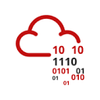
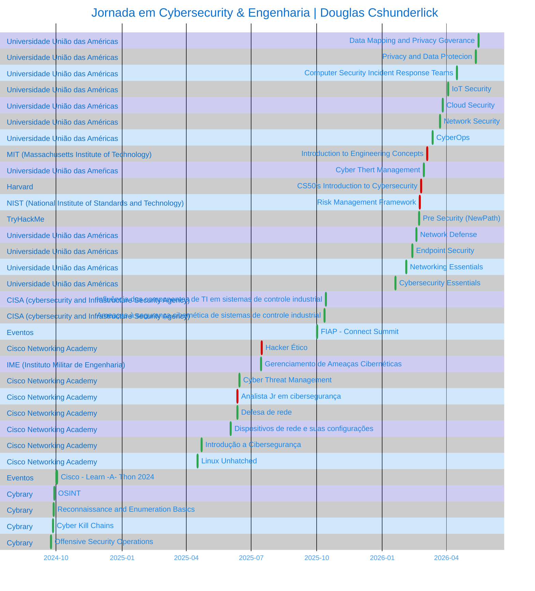

<!-- ══════════════════════ IDIOMAS / LANGUAGES ══════════════════════ -->

 

  

  

  

     
 

  

 

## Douglas Cshunderlick

<table>
<tr>
<td valign="top" width="30%">
  Acerca de

  

Desarrollador de Software enfocado en Seguridad Ofensiva y Gobernanza.
Uno la base técnica en desarrollo a la mentalidad de atacante para crear
sistemas resilientes desde el código.

Actualmente Top 6% en el ranking global de TryHackMe, con práctica constante
en pentests autorizados, análisis de vulnerabilidades y desarrollo de
herramientas personalizadas para automatización de seguridad.

<!-- ══════════════════════════ NAVEGAÇÃO ══════════════════════════ -->

Atajos

  

   

<a href="#formacao">

</td>
<td valign="center" width="15%">

</a>

</td>
</tr>
</table>

 

<pre>
  
</pre>

 

  

<!-- ══════════════════════════ TECNOLOGIAS ══════════════════════════ -->

## Tecnologías que utilizo

<table>
<tr>
<td valign="top" width="33%" align="center">

**Recon y Enumeración**

  

</td>
<td valign="top" width="33%" align="center">

**Explotación y Análisis**

  

</td>
<td valign="top" width="33%" align="center">

**Frameworks & GRC**

  

</table>

 
 

  

<!-- ══════════════════════════ PROJETOS ══════════════════════════ -->

## Proyectos y Write-ups Destacados

>Portafolio práctico de pentests en entornos autorizados (HTB, TryHackMe, labs y proyectos propios). 
Todos con informes detallados.
 

- [**MBA em Segurança da Informação**](https://github.com/douglascshun/PosSegurancaDaInformacao) 
Repositorio central de estudios, resúmenes técnicos y documentación práctica.  
Skills: Este repositorio fue estructurado para consolidar el conocimiento adquirido a lo largo del MBA, sirviendo como una base de consulta rápida para aplicación en el día a día profesional y revisiones académicas.
 

- [**TryHackMe Poster**](https://github.com/douglascshun/cybersec-portfolio/tree/main/Relatorios/relatorioPosterTHM#readme) 
Explotación vía PostgreSQL CVE-2019-9193 + priv esc sudo 
Skills: Nmap, credential stuffing, sudo misconfig, PoC RCE.
 

- [**HTB Meow**](https://github.com/douglascshun/cybersec-portfolio/tree/main/Relatorios/relatorioMeowHTB#readme) 
Bypass root vía Telnet + Alpine misconfig 
Skills: Enumeración servicios, hard-coded creds, root directo.

 
 

  

<!-- ══════════════════════════ PROJETOS ══════════════════════════ -->

## Contribuciones

 
 

  

<!-- ══════════════════════════ FORMAÇÂO ══════════════════════════ -->
## Formación Académica

<table>
<thead>
<tr>
<th align="left">Institución</th>
<th align="left">Curso</th>
<th align="left">Período</th>
</tr>
</thead>
<tbody>
<tr>
<td> <strong>União das Américas</strong></td>
<td>MBA em Segurança da Informação</td>
<td>Nov 2025 – Nov 2026 (previsto)</td>
</tr>
<tr>
<td> <strong>União das Américas</strong></td>
<td>Pós-graduação em Engenharia de Software</td>
<td>Nov 2025 – Nov 2026 (previsto)</td>
</tr>
<tr>
<td> <strong>Universidade Cruzeiro do Sul</strong></td>
<td>Análise e Desenvolvimento de Sistemas</td>
<td>Jan 2023 – Dez 2025 (completado)</td>
</tr>
<tr>
<td> <strong>IFSP</strong></td>
<td>Técnico em Administração</td>
<td>2019 – 2020 (completado)</td>
</tr>
</tbody>
</table>

 
 

  

<!-- ══════════════════════════ certificações ══════════════════════════ -->
## Certificaciones & Badges

<table>
<!-- ─────────────── LINHA 1 ─────────────── -->
<tr>
<td valign="top" width="33%" align="center">

**Harvard**

Ver competencias

CS50's Introduction to Cybersecurity:
- Garantizando la seguridad de las cuentas
- Protegiendo Datos
- Garantizando la seguridad de los sistemas
- Protegiendo Software
- Preservando la Privacidad

</td>
<td valign="top" width="33%" align="center">

**MIT**

Ver competencias

Introduction to Engineering Concepts:
- Lab de filtración inspirado en el estudio del MIT LL sobre la propagación del COVID en el transporte público de NY (Biotecnología y Sistemas Humanos).
- Lab de etiquetas Bluetooth derivado del proyecto Privacy Automated Contact Tracing — PACT (Cyber Security & Information Sciences).
- Lab de ajedrez Clausewitzian, de un estudio de guerra adaptativa multidominio gamificado del MIT LL (Homeland Protection).
- Comprensión general de la ingeniería y sus aplicaciones en áreas relacionadas.
- Familiaridad con el proceso de ingeniería.
- Aplicación del proceso de ingeniería para resolver problemas reales.

</td>
<td valign="top" width="33%" align="center">

**CISA**

Ver competencias

210W-02 — Influencia de los componentes de TI en ICS:
- Convergencia TI/TO: la modernización cambia sistemas aislados por digitales conectados.
- Los componentes de TI traen vulnerabilidades a la planta de producción.
- El monitoreo y SCADA procesan grandes volúmenes de datos.
- IoT y análisis de datos reducen costos y aumentan la productividad.

210W-06 — Amenazas cibernéticas a ICS:
- Atributos de la amenaza humana y categorías de agentes.
- Curva de riesgo y tendencias de amenazas para ICS.
- Amenazas internas intencionales vs. no intencionales.
- Herramientas y técnicas de ataque.

</td>
</tr>

<!-- ─────────────── LINHA 2 ─────────────── -->
<tr>
<td valign="top" width="33%" align="center">

**IME**

Ver competencias

Gestión de Amenazas Cibernéticas:
- Conformidad con frameworks de compliance.
- Evaluación de vulnerabilidad de redes y sistemas.
- Plan de gestión de riesgos y respuesta a incidentes.
- Investigaciones forenses de incidentes de seguridad.

</td>
<td valign="top" width="33%" align="center">

**NIST**

Ver competencias

NIST RMF Course V2:
- El Marco de Gestión de Riesgos (RMF) del NIST es un proceso de 7 etapas — integral, flexible, repetible y medible — para gestionar riesgos de seguridad de la información y privacidad, alineado con los estándares NIST y los requisitos de la FISMA.

</td>
<td valign="top" width="33%" align="center">

**Cisco Networking Academy**

Ver competencias

Hacker Ético

- Importancia del hacking ético metodológico y del pentest.
- Crear documentos preliminares para pruebas de intrusión.
- Recolección de información y escaneo de vulnerabilidades.
- Cómo los ataques de ingeniería social tienen éxito.
- Explotar vulnerabilidades en redes cableadas e inalámbricas.
- Explotar vulnerabilidades basadas en aplicaciones.
- Explotar vulnerabilidades en nube, dispositivos móviles e IoT.
- Realizar actividades de post-explotación.
- Crear un informe de prueba de intrusión.
- Clasificar herramientas de pentesting por caso de uso.

Analista Júnior em Cyber Segurança

- Recomendar controles de ciberseguridad.
- Mitigar amenazas a la seguridad de red y de sistemas.
- Evaluar la postura de seguridad con herramientas de evaluación.
- Recomendar actividades de gestión de incidentes.
- Actuar como profesional de seguridad de red.

Defesa de Redes

- Documentar una postura de seguridad de red.
- Configurar seguridad en dispositivos y endpoints Linux/Windows.
- Implementar gestión del ciclo de vida de identidad.
- Configurar un firewall de red simulado.
- Recomendar medidas de seguridad en nube.
- Protección de datos en tránsito y almacenamiento.
- Uso de PKI para aumentar la seguridad de los datos.
- Implementar entornos de computación virtual.

Dispositivos de Rede e Configuração Inicial

- Componentes de un diseño de red jerárquico.
- Conversiones entre decimal, binario y hexadecimal.
- Operación de Ethernet en red conmutada.
- Cálculo de subred IPv4.
- Funcionamiento de ARP, DNS y DHCP.
- Protocolos de la capa de transporte.
- Cisco IOS y construcción de red con dispositivos Cisco.

Segurança em Endpoint

- Desafíos únicos por tipo de dato.
- Mitigación de amenazas de red comunes y emergentes.
- Configurar red simulada según requisitos.
- Analizar malware extraído de capturas de paquetes.
- Evaluar la seguridad de endpoints.

Networking Basics

- Conceptos de comunicación, tipos, componentes y conexiones.
- Estándares y protocolos en las comunicaciones de red.
- Comunicación en redes Ethernet.
- Direccionamiento IPv4 e IPv6.
- Cómo los routers conectan redes.
- Herramientas de troubleshooting de conectividad.
- Configurar router y cliente inalámbrico con seguridad.

Introdução a Cybersecurity

- Básico de seguridad online y su impacto.
- Amenazas, ataques y vulnerabilidades comunes.
- Cómo protegerse online.
- Cómo las organizaciones protegen sus operaciones.
- Opciones de carrera en ciberseguridad.

Linux Unhatched

- Fundamentos de la línea de comandos Linux.
- Navegación por directorios y listado de archivos.
- Crear, mover y eliminar archivos/directorios.
- Buscar y extraer datos de archivos.
- Transformar comandos repetitivos en scripts.
- Dónde se almacena la información en Linux.
- Consultar configuraciones de red.
- Gestionar usuarios, permisos y propiedad.

</td>
</tr>

<!-- ─────────────── LINHA 3 ─────────────── -->
<tr>
<td valign="top" width="33%" align="center">

**Centro Univ. União das Américas**

Ver competencias

Cybersecurity Essentials

- Conceptos de Seguridad Cibernética
- Amenazas, Ataques y Vulnerabilidades
- Medidas de Seguridad
- Controles para Redes, Servidores y Aplicaciones
- Políticas de Seguridad
- Disponibilidad y Confidencialidad de los Datos
- Cisco Packet Tracer
- Pensamiento Crítico

Networking Essentials

- Comunicación de Datos
- Conceptos básicos de redes
- Componentes y Modelos de Red
- Protocolos de Comunicación
- Arquitectura de protocolo IP
- Capa de aplicación
- Gestión de red

Endpoint Security

- Amenazas y ciberataques a los endpoints
- Protección de Archivos
- Herramientas de protección de estaciones
- Seguridad Endpoint Windows y Linux
- Protección de servicios de nube
- Protección de dispositivos móviles
- IoT Security

Network Defense

- Monitoreo y defensa de redes
- Técnicas de protección de redes
- Control de acceso y Firewalls
- Seguridad en la nube
- Criptografía
- Estrategia de ciberseguridad

CyberOps

- Arquitectura de Seguridad Linux y Windows
- Infraestructura de Seguridad en Red
- Defensa de seguridad en red
- Evaluación de Vulnerabilidad
- Monitoreo de la Seguridad de la Información
- Respuesta a incidentes
- Computación forense

</td>
<td valign="top" width="33%" align="center">

**TryHackMe**

Ver competencias

Pre Security (New Path):
- Redes y Web: comunicación y vulnerabilidades de red.
- Sistemas: Windows, Linux (CLI) y Cloud.
- Software: Python, JS y SQL.
- Defensa/Ataque: mentalidad hacker y la Tríada CIA.

</td>
<td valign="top" width="33%" align="center">

**FIAP**

Ver competencias

Fiap Connect Summit (evento):
- Inmersión de cuatro días en las áreas de Tecnología y Negocios.

</td>
</tr>
</table>

<a href="https://www.linkedin.com/in/cshunderlick/details/certifications/">Ver todas las credenciales en LinkedIn →</a>

 
 

  

<!-- ══════════════════════════ JORNADA ══════════════════════════ -->

## Trayectoria en Ciberseguridad e Ingeniería

 
 

  

<!-- ══════════════════════════ CONTATO ══════════════════════════ -->

## Conéctate Conmigo

 

  

  

 
 

  

#### Cuando se piensa como quien observa, descubres si el esfuerzo de escalar tu muro vale la recompensa que está allí dentro.
