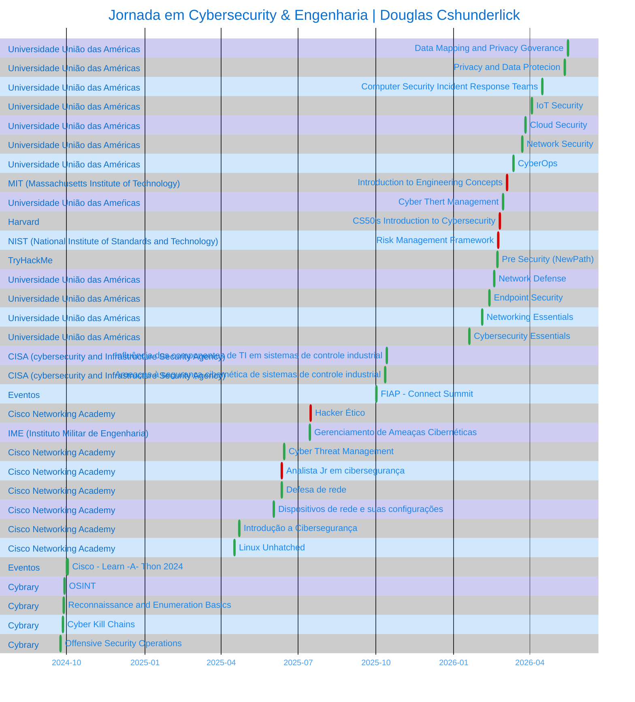

<!-- ══════════════════════ IDIOMAS / LANGUAGES ══════════════════════ -->

 

  

  

  

     
 

  

 

## Douglas Cshunderlick

<table>
<tr>
<td valign="top" width="30%">
  Sobre

  

Desenvolvedor de Software com foco em Segurança Ofensiva e Governança.
Uno a base técnica em desenvolvimento à mentalidade de atacante para criar
sistemas resilientes desde o código.

Atualmente Top 6% no ranking global do TryHackMe, com prática constante
em pentests autorizados, análise de vulnerabilidades e desenvolvimento de
ferramentas customizadas para automação de segurança.

<!-- ══════════════════════════ NAVEGAÇÃO ══════════════════════════ -->

Atalhos

  

   

<a href="#formacao">

</td>
<td valign="center" width="15%">

</a>

</td>
</tr>
</table>

 

<pre>
  
</pre>

 

  

<!-- ══════════════════════════ TECNOLOGIAS ══════════════════════════ -->

## Tecnologias que utilizo

<table>
<tr>
<td valign="top" width="33%" align="center">

**Recon & Enumeração**

  

</td>
<td valign="top" width="33%" align="center">

**Exploração & Análise**

  

</td>
<td valign="top" width="33%" align="center">

**Frameworks & GRC**

  

</table>

 
 

  

<!-- ══════════════════════════ PROJETOS ══════════════════════════ -->

## Projetos & Write-ups em Destaque

>Portfólio prático de pentests em ambientes autorizados (HTB, TryHackMe, labs e projetos próprios). 
Todos com relatórios detalhados.
 

<table>
<tr>
<td valign="top" width="50%">

**[cybersec-portfolio](https://github.com/douglascshun/cybersec-portfolio)** 

Relatórios de pentest (**RabbitSec**) — comprometimento total por misconfig + credenciais padrão.

  

▸ **[TryHackMe Poster](https://github.com/douglascshun/cybersec-portfolio/tree/main/Relatorios/relatorioPosterTHM#readme)** — PostgreSQL `CVE-2019-9193` + sudo priv esc 
▸ **[HTB Meow](https://github.com/douglascshun/cybersec-portfolio/tree/main/Relatorios/relatorioMeowHTB#readme)** — Telnet + Alpine misconfig → root

</td>
<td valign="top" width="50%">

**[automacao-linkedin](https://github.com/douglascshun/automacao-linkedin)** 

Automação autônoma de posts no LinkedIn — reescreve `.md` com IA (Gemini), gera capa e publica pela API oficial. 100% GitHub Actions.

  

</td>
</tr>
<tr>
<td valign="top" width="50%">

**[ConfigDeLabP2P](https://github.com/douglascshun/ConfigDeLabP2P)** 

Link Ponto-a-Ponto de altíssima velocidade: SSHFS persistente bidirecional + Deskflow, eliminando scp/sftp e senhas.

  

</td>
<td valign="top" width="50%">

**[MBA em Segurança da Informação](https://github.com/douglascshun/PosSegurancaDaInformacao)** 

Anotações do Pós-MBA: resumos, mapas mentais, normas, governança e gestão de riscos.

  

</td>
</tr>
</table>

 
 

  

<!-- ══════════════════════════ PROJETOS ══════════════════════════ -->

## Contibuições

 
 

  

<!-- ══════════════════════════ FORMAÇÂO ══════════════════════════ -->
## Formação Acadêmica

<table>
<thead>
<tr>
<th align="left">Instituição</th>
<th align="left">Curso</th>
<th align="left">Período</th>
</tr>
</thead>
<tbody>
<tr>
<td> <strong>União das Américas</strong></td>
<td>MBA em Segurança da Informação</td>
<td>Nov 2025 – Nov 2026 (previsão)</td>
</tr>
<tr>
<td> <strong>União das Américas</strong></td>
<td>Pós-graduação em Engenharia de Software</td>
<td>Nov 2025 – Nov 2026 (previsão)</td>
</tr>
<tr>
<td> <strong>Universidade Cruzeiro do Sul</strong></td>
<td>Análise e Desenvolvimento de Sistemas</td>
<td>Jan 2023 – Dez 2025 (concluído)</td>
</tr>
<tr>
<td> <strong>IFSP</strong></td>
<td>Técnico em Administração</td>
<td>2019 – 2020 (concluído)</td>
</tr>
</tbody>
</table>

 
 

  

<!-- ══════════════════════════ certificações ══════════════════════════ -->
## Certificações & Badges

<table>
<!-- ─────────────── LINHA 1 ─────────────── -->
<tr>
<td valign="top" width="33%" align="center">

**Harvard**

Ver competências

- Garantindo a segurança das contas
- Protegendo Dados
- Garantindo a segurança dos sistemas
- Protegendo Software
- Preservando a Privacidade

</td>
<td valign="top" width="33%" align="center">

**MIT**

Ver competências

- Lab de filtração inspirado no estudo do MIT LL sobre a propagação da COVID no transporte público de NY (Biotecnologia e Sistemas Humanos).
- Lab de etiquetas Bluetooth derivado do projeto Privacy Automated Contact Tracing — PACT (Cyber Security & Information Sciences).
- Lab de xadrez Clausewitzian, de um estudo de guerra adaptativa multidomínio gamificado do MIT LL (Homeland Protection).
- Compreensão geral da engenharia e suas aplicações em áreas relacionadas.
- Familiaridade com o processo de engenharia.
- Aplicação do processo de engenharia para resolver problemas reais.

</td>
<td valign="top" width="33%" align="center">

**CISA**

Ver competências

- Convergência TI/TO: modernização troca sistemas isolados por digitais conectados.
- Componentes de TI trazem vulnerabilidades ao chão de fábrica.
- Monitoramento e SCADA processam grandes volumes de dados.
- IoT e análise de dados reduzem custos e aumentam produtividade.

- Atributos da ameaça humana e categorias de agentes.
- Curva de risco e tendências de ameaças para ICS.
- Ameaças internas intencionais vs. não intencionais.
- Ferramentas e técnicas de ataque.

</td>
</tr>

<!-- ─────────────── LINHA 2 ─────────────── -->
<tr>
<td valign="top" width="33%" align="center">

**IME**

Ver competências

- Conformidade com frameworks de compliance.
- Avaliação de vulnerabilidade de redes e sistemas.
- Plano de gestão de riscos e resposta a incidentes.
- Investigações forenses de incidentes de segurança.

</td>
<td valign="top" width="33%" align="center">

**NIST**

Ver competências

- A Estrutura de Gestão de Riscos (RMF) do NIST é um processo de 7 etapas — abrangente, flexível, repetível e mensurável — para gerenciar riscos de segurança da informação e privacidade, alinhado aos padrões NIST e aos requisitos da FISMA.

</td>
<td valign="top" width="33%" align="center">

**Cisco Networking Academy**

Ver competências

- Importância do hacking ético metodológico e do pentest.
- Criar documentos preliminares para testes de invasão.
- Coleta de informações e varredura de vulnerabilidades.
- Como ataques de engenharia social são bem-sucedidos.
- Explorar vulnerabilidades em redes cabeadas e sem fio.
- Explorar vulnerabilidades baseadas em aplicações.
- Explorar vulnerabilidades em nuvem, dispositivos móveis e IoT.
- Realizar atividades de pós-exploração.
- Criar um relatório de teste de invasão.
- Classificar ferramentas de pentesting por caso de uso.

- Recomendar controles de cibersegurança.
- Mitigar ameaças à segurança de rede e de sistemas.
- Avaliar a postura de segurança com ferramentas de avaliação.
- Recomendar atividades de gestão de incidentes.
- Atuar como profissional de segurança de rede.

- Documentar uma postura de segurança de rede.
- Configurar segurança em dispositivos e endpoints Linux/Windows.
- Implementar gestão do ciclo de vida de identidade.
- Configurar um firewall de rede simulado.
- Recomendar medidas de segurança em nuvem.
- Proteção de dados em transporte e armazenamento.
- Uso de PKI para aumentar a segurança dos dados.
- Implementar ambientes de computação virtual.

**Dispositivos de Rede e Configuração Inicial**

- Componentes de um design de rede hierárquico.
- Conversões entre decimal, binário e hexadecimal.
- Operação do Ethernet em rede comutada.
- Cálculo de sub-rede IPv4.
- Funcionamento de ARP, DNS e DHCP.
- Protocolos da camada de transporte.
- Cisco IOS e construção de rede com dispositivos Cisco.

- Desafios únicos por tipo de dado.
- Mitigação de ameaças de rede comuns e emergentes.
- Configurar rede simulada conforme requisitos.
- Analisar malware extraído de capturas de pacotes.
- Avaliar a segurança de endpoints.

- Conceitos de comunicação, tipos, componentes e conexões.
- Padrões e protocolos nas comunicações de rede.
- Comunicação em redes Ethernet.
- Endereçamento IPv4 e IPv6.
- Como roteadores conectam redes.
- Ferramentas de troubleshooting de conectividade.
- Configurar roteador e cliente sem fio com segurança.

- Básico de segurança online e seu impacto.
- Ameaças, ataques e vulnerabilidades comuns.
- Como se proteger online.
- Como organizações protegem suas operações.
- Opções de carreira em cibersegurança.

- Fundamentos da linha de comando Linux.
- Navegação por diretórios e listagem de arquivos.
- Criar, mover e excluir arquivos/diretórios.
- Pesquisar e extrair dados de arquivos.
- Transformar comandos repetitivos em scripts.
- Onde informações são armazenadas no Linux.
- Consultar configurações de rede.
- Gerenciar usuários, permissões e propriedade.

</td>
</tr>

<!-- ─────────────── LINHA 3 ─────────────── -->
<tr>
<td valign="top" width="33%" align="center">

**Centro Univ. União das Américas**

Ver competências

- Conceitos de Segurança Cibernética
- Ameaças, Ataques e Vulnerabilidades
- Medidas de Segurança
- Controles para Redes, Servidores e Aplicativos
- Políticas de Segurança
- Disponibilidade e Sigilo dos Dados
- Cisco Packet Tracer
- Pensamento Crítico

- Comunicação de Dados
- Conceitos básicos de redes
- Componentes e Modelos de Rede
- Protocolos de Comunicação
- Arquitetura de protocolo IP
- Camada de aplicação
- Gerenciamento de rede

- Ameaças e ciberataques aos endpoints
- Proteção de Arquivos
- Ferramentas de proteção de estações
- Segurança Endpoint Windows e Linux
- Proteção de serviços de nuvem
- Proteção de dispositivos móveis
- IoT Security

- Monitoramento e defesa de redes
- Técnicas de proteção de redes
- Controle de acesso e Firewalls
- Segurança na nuvem
- Criptografia
- Estratégia de cibersegurança

- Arquitetura de Segurança Linux e Windows
- Infraestrutura de Segurança em Rede
- Defesa de segurança em rede
- Avaliação de Vulnerabilidade
- Monitoramento da Segurança da Informação
- Resposta a incidentes
- Computação forense

</td>
<td valign="top" width="33%" align="center">

**TryHackMe**

Ver competências

- Redes e Web: comunicação e vulnerabilidades de rede.
- Sistemas: Windows, Linux (CLI) e Cloud.
- Software: Python, JS e SQL.
- Defesa/Ataque: mentalidade hacker e a Tríade CIA.

</td>
<td valign="top" width="33%" align="center">

**FIAP**

Ver competências

- Imersão de quatro dias nas áreas de Tecnologia e Negócios.

</td>
</tr>
</table>

<a href="https://www.linkedin.com/in/cshunderlick/details/certifications/">Ver todas as credenciais no LinkedIn →</a>

 
 

  

<!-- ══════════════════════════ JORNADA ══════════════════════════ -->

## Jornada em Cybersecurity & Engenharia

 
 

  

<!-- ══════════════════════════ CONTATO ══════════════════════════ -->

## Conecte-se Comigo

 

  

  

 
 

  

#### Quando se pensa como quem observa, você descobre se o esforço de escalar o seu muro vale a recompensa que está lá dentro.
